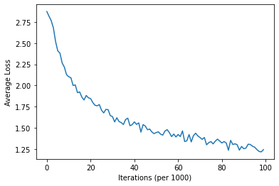
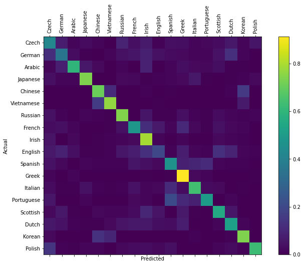

# Recurrent Neural Networks

An implementation of RNNs using PyTorch for a simple name-to-language classification task

## Setup

Set up a python virtual/conda environment and install from `requirements.txt`

## Data

The language to names data can be downloaded [here](https://download.pytorch.org/tutorial/data.zip) and is also available in the `data` directory.

## Model

(Source <https://pytorch.org/tutorials/intermediate/char_rnn_classification_tutorial.html>)

## Training

Network is trained for 100000 iterations on random generations of data points with a lr of 0.0056

## Results

We get an accuracy of 58% on the complete dataset using this network and training scheme.

Confusion matrix on 10000 randomly selected points from dataset (Without replacement)

### Acknowledgement

-   [Official PyTorch Tutorial](https://pytorch.org/tutorials/intermediate/char_rnn_classification_tutorial.html)
